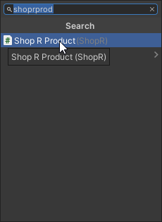
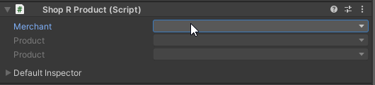
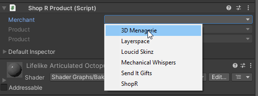
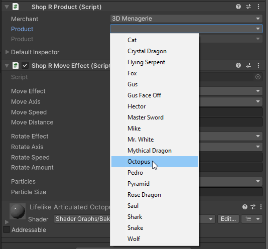

## What does this do?

This component tells ShopR to treat this model as a sellable product. This will allow users to add it to their cart.
:::warning
Your product must exist in the ShopR backend for this process to work. Please reach out to the ShopR Team to do this if you have not already
:::

## How do I do this?

1. Add your product model to the scene.

2. In the **Inspector** window, click on the **Add Component** button and search for **ShopR Product**.

3. Click on the **ShopR Product** component to add it to the model.

4. In the Shop R Product component fill out the fields for this product one at a time. In this example this is 3D Menagerie's Octopus (White).

