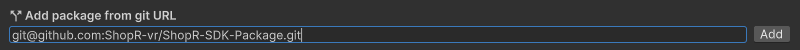

# Installing the ShopR SDK
## Installation Steps

Follow these steps to install the ShopR SDK in your Unity project:

### 1. Open Your Unity Project

Launch Unity Hub and open your project. This process may take a few minutes, depending on your project's size and complexity.


:::tip
If you're working with a version control system like Git, ensure you've pulled the latest changes before opening your project.
:::

### 2. Navigate to Package Manager

Once your project is open, follow these steps to access the Package Manager:

1. In the Unity interface, go to the top menu.
2. Select **Window** > **Package Manager**.


:::info
The Package Manager is Unity's central hub for managing external packages and SDKs. It's where we'll add the ShopR SDK to your project.
:::

### 3. Add the ShopR SDK

Now that you're in the Package Manager, let's add the ShopR SDK:

1. Click on the **+** button in the top left corner of the Package Manager.
2. Choose **Add package from git URL...** from the dropdown menu.


3. In the input field that appears, enter the following URL:

```
https://github.com/ShopR/unity-sdk.git
```



:::caution
Double-check the URL before proceeding. An incorrect URL can lead to installation errors or downloading the wrong package.
:::

### 4. Complete Installation

After entering the correct URL:

1. Click the **Add** button.
2. Unity will now download and install the ShopR SDK. This process may take a few moments, depending on your internet connection speed.
3. Once the installation is complete, you'll see the ShopR SDK listed in your Package Manager.

:::success
Congratulations! Your ShopR SDK is now installed and ready for use!
:::

## Troubleshooting

If you encounter any issues during the installation process, consider the following:

- Ensure your internet connection is stable.
- Verify that you have the necessary permissions to install packages in your Unity project.
- Double-check that you've completed all steps in the [Prerequisites Guide](../prerequisites).


## Next Steps

Now that you have successfully installed the ShopR SDK, you're ready to start creating and uploading virtual worlds! Check out our [Getting Started Guide](./UploadingUsingSDK.md) to begin uploading your first Showroom to the ShopR platform.

:::info
We're constantly improving our SDK and documentation. If you have any feedback or suggestions, please don't hesitate to reach out to our support team.
:::