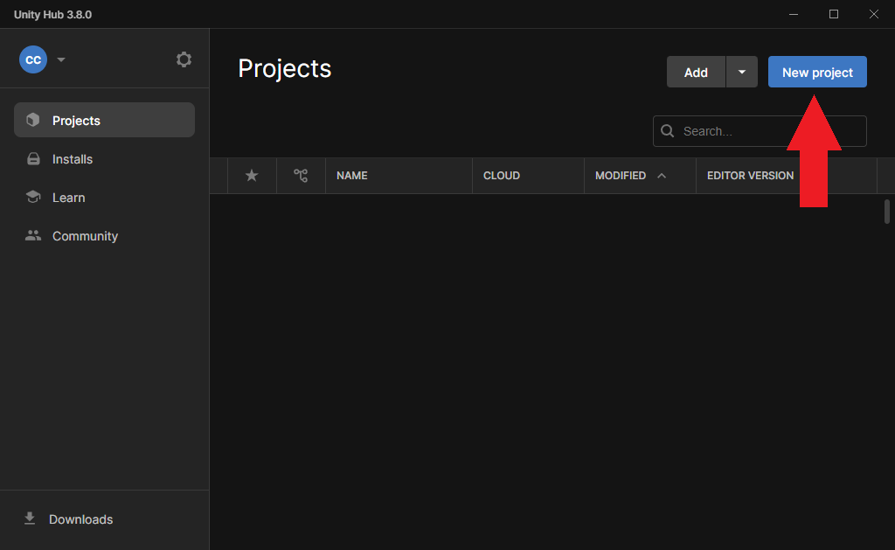
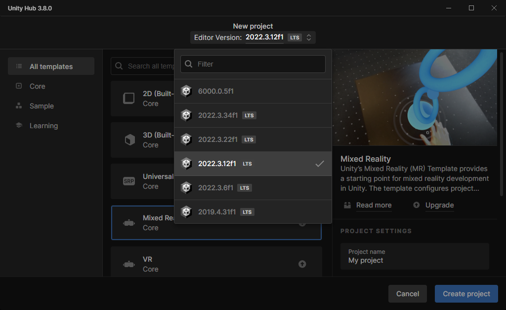
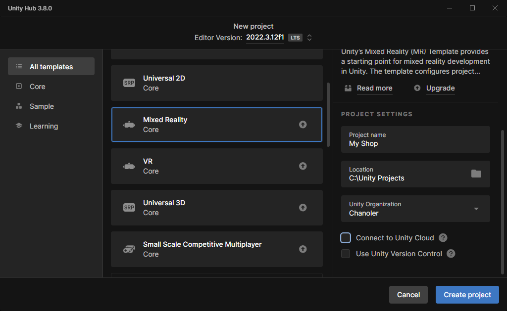

---
title: 1. Setting up a Unity project
sidebar_position: 10
description: A comprehensive guide to setting up a Unity project for uploading virtual store showrooms using the ShopR SDK.
---

# Setting Up Your Unity Project for ShopR

Before you can start creating and uploading virtual store showrooms to ShopR, you need to set up your Unity project correctly. This guide will walk you through the process step-by-step, ensuring you have the right Unity version and project settings for optimal compatibility with the ShopR SDK.

## Prerequisites

:::caution
Before proceeding with the installation, make sure you've completed all the steps outlined in our [Project Setup Guide](../Prerequisites). This will ensure you have the correct Unity version and all necessary accounts and tools set up.
:::

## Step-by-Step Setup Process

### 1. Create a New Unity Project

Let's start by creating a fresh Unity project tailored for our ShopR integration:

1. Launch Unity Hub on your computer.
2. In the Projects tab, click on the **New project** button.

:::tip
Organizing your projects within Unity Hub helps manage multiple projects efficiently. Consider creating a dedicated folder for your ShopR-related projects.
:::

### 2. Select the Correct Unity Version

Choosing the right Unity version is crucial for compatibility with the ShopR SDK:

1. In the New Project window, locate the Version dropdown menu.
2. Select **Unity 2022.3.12f1** from the list.

:::caution
If you don't see Unity 2022.3.12f1 in the list, you'll need to install it:
1. Visit the [Unity Download Archive](https://unity.com/releases/editor/archive).
2. Find and download Unity 2022.3.12f1.
3. Follow the installation prompts in Unity Hub.
   :::

### 3. Choose the Mixed Reality Template

To ensure your project is set up correctly for virtual showrooms:

1. In the project creation window, select the **Mixed Reality** template.
2. Give your project a descriptive name (e.g., "ShopRShowroom").
3. Choose a suitable location on your hard drive to save the project.
4. Click on the **Create project** button to finalize the setup.

:::tip Pro Tip
Using the Mixed Reality template provides a solid foundation for creating immersive virtual showrooms. It includes pre-configured settings and assets.
:::

## Next Steps

Congratulations! You've successfully set up your Unity project for ShopR.

You can now head over to the [ShopR SDK Installation Guide](./SDKInstall.md) to add the ShopR SDK to your project.

:::info
Remember, the ShopR SDK is regularly updated. Make sure to check for updates in the Unity Package Manager to access the latest features and improvements.
:::

:::warning Having Trouble?
If you encounter any issues during the setup process, don't hesitate to reach out to our Discord community for assistance.
:::