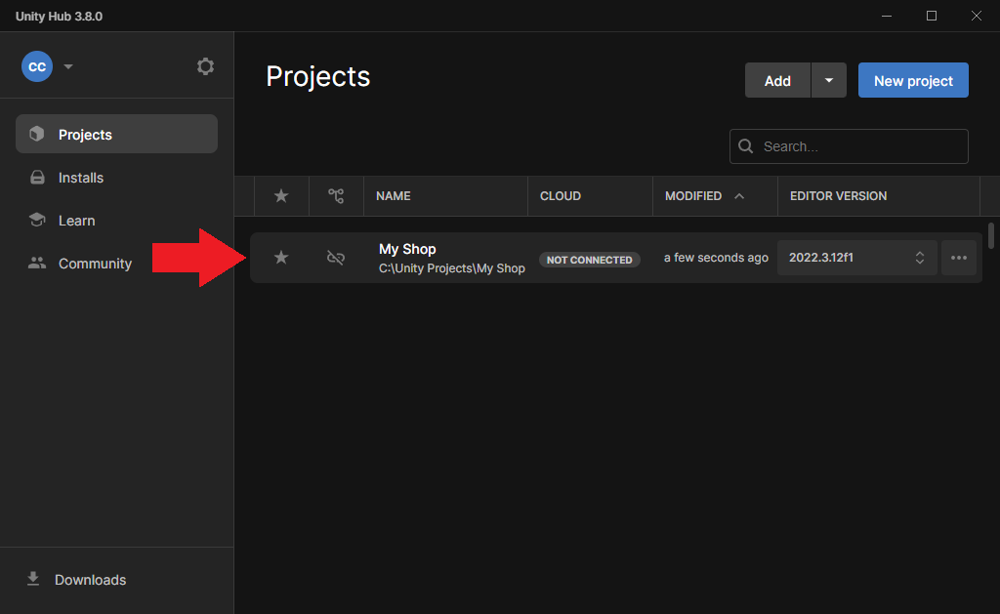
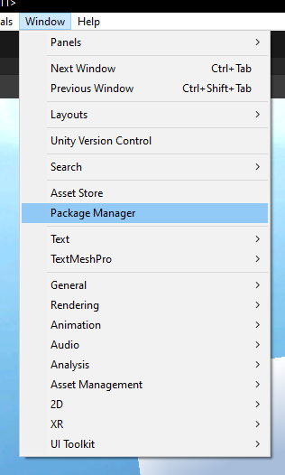
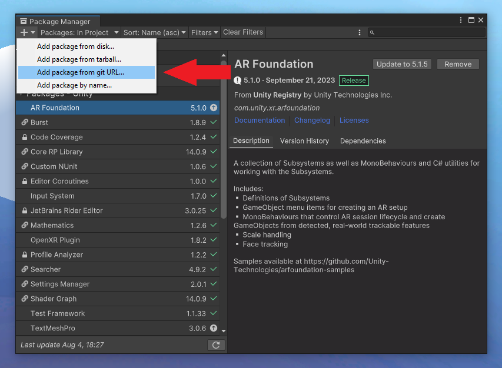
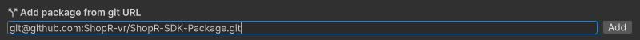

---
title: Installing the SDK
sidebar_position: 20
---

## Installing the ShopR SDK

1. Open your Unity project. This may take a few minutes.



2. On the top bar go to **Window** > **Package Manager**



3. Click on the **+** button and select **Add package from git URL...**



4. Paste the following URL into the text field and click on the **Add** button.

```
git@github.com:ShopR-vr/ShopR-SDK-Package.git
```



5. The package will now complete the installation process. This may take a few seconds.