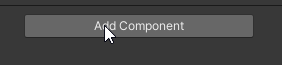
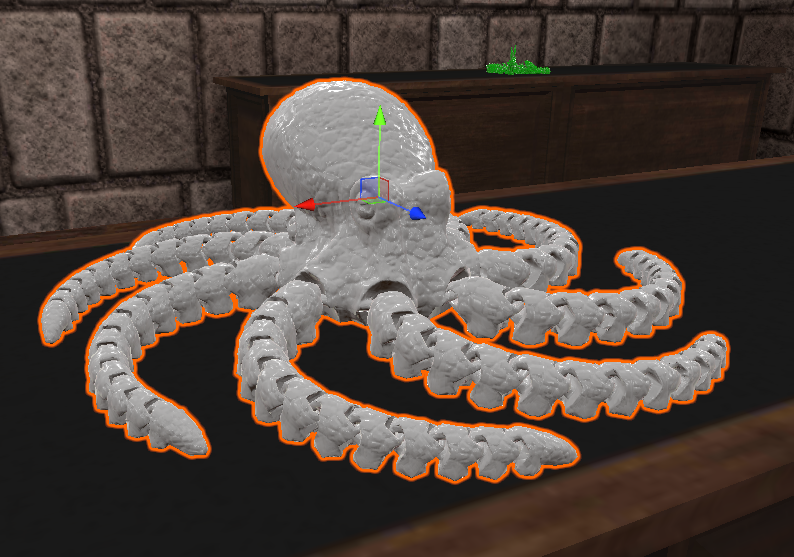

# Setting up a ShopR Product

This guide will walk you through the process of setting up a product in your ShopR virtual showroom using the ShopR SDK.

## Prerequisites
1. Before proceeding, ensure that your product exists in the ShopR backend.
:::tip
If you haven't set up your product in the backend yet, please contact the ShopR Team for assistance.
:::
  
2. Make sure your product has a collision.
:::tip
Using `Add component > Physics > Box Collider` is an easy way to ensure your product has a basic collision.

:::

## Step-by-Step Configuration

Follow these steps to set up a ShopR Product in your Unity scene:

### 1. Add Product Model to Scene

Import and place your product model in the Unity scene.

### 2. Add ShopR Product Component

1. Select your product model in the Hierarchy window.
2. In the Inspector window, click the **Add Component** button.
3. Search for and select **ShopR Product**.

### 3. Configure ShopR Product Component

Once added, the ShopR Product component will appear in the Inspector.

### 4. Fill Out Product Details

Complete the fields in the ShopR Product component. Let's use the example of 3D Menagerie's Octopus (White):

> Merchant
>>

> Product
>>

> Variant (if applicable)
>>

:::tip
Take care to fill out each field accurately. The information you provide here will be used to assign your model to product in the ShopR platform.
:::

## Bulk Management Tools

The ShopR Product component includes several tools to help you manage multiple products efficiently. These tools are located in the "Tools" foldout at the bottom of the component.

### Available Tools

1. **Set All Products to This Merchant**
    - Function: Assigns the currently selected merchant to all products in the scene.
    - Use case: Ideal when all items in a showroom belong to the same merchant.

2. **Set All Products with Same Mesh to This Product**
    - Function: Configures all products in the scene that share the same mesh as the current product.
    - Use case: Useful for setting up variations of the same product (e.g., different colors of the same model).

3. **Select All Products Not Set to a Product**
    - Function: Selects all GameObjects in the scene with incomplete ShopR Product components.
    - Use case: Helps identify products that still need configuration.

:::info
These tools can significantly speed up your workflow, especially when working with large showrooms or multiple variations of products.
:::

## Best Practices

- **Consistency**: Ensure consistency in naming and categorization across your products.
- **Organization**: Use Unity's hierarchy to organize your products logically (e.g., by category).
- **Regular Updates**: Keep your product information up-to-date in the ShopR backend.

## Troubleshooting

If you encounter issues while setting up your products:

1. Verify that the product exists in the ShopR backend.
2. Ensure required fields in the ShopR Product component are filled out.
3. Check the Unity console for any error messages related to the ShopR SDK. Clearing the console and checking for any persistent errors can help identify issues.

For persistent issues, please contact our team for assistance.

## Next Steps

After setting up your products you should also consider:

1. Making your product more interesting by [animating it](MakingAProductPop).